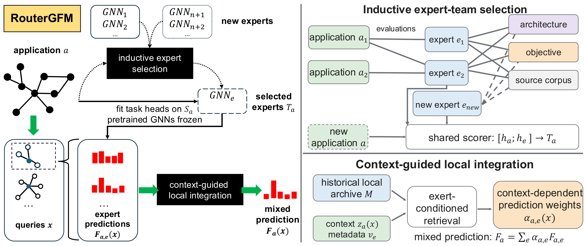

# RouterGFM: Inductive Routing and Local Expertise Transfer for Graph Learning



*Overview of RouterGFM ([PDF](RouterGFM-overview.pdf)).*

RouterGFM reuses a pool of independently pretrained GNNs through two decisions made at different scales:

- **Inductive expert-team selection.** A heterogeneous context graph links applications, experts, architectures,
  pretraining objectives, and source corpora. Evaluation edges carry historical average losses and evaluation counts.
  A shared scorer over `[h_a; h_e]` estimates each candidate's loss and selects a team `T_a` of at most `K` experts.
  New applications and new experts enter through metadata and construction edges. The router is not retrained, and
  candidate GNNs are not executed on the target.
- **Context-guided local integration.** After the selected task heads are fitted on the support set `S_a`, an
  expert-conditioned retrieval over a historical local archive `M` transfers centered local performance differences
  into instance-dependent prediction weights `alpha_{a,e}(x)`. The mixed prediction is
  `F_a(x) = sum_e alpha_{a,e}(x) F_{a,e}(x)`.

Pretrained GNNs and router parameters stay fixed at deployment; only the selected task heads are fitted on the target.

## Repository layout

```
src/
├── config/        # YACS defaults, one module per block (_model, _pretrain, _train, _finetune, _moe_*, ...)
├── data_loader/   # dataset registry, few-shot / edge splits, SVD features, induced subgraphs
├── model/         # GCN, GAT, GIN, H2GCN, FAGCN, NodeFormer, Transformer encoders
├── pretrain/      # 7 pretraining objectives that build the expert pool
├── train/         # supervised graph models trained from scratch
├── finetune/      # adaptation catalog: full fine-tuning and nine prompting variants
├── moe/
│   ├── routergfm/ # RouterGFM: history, context graph, router, local integration, deployment
│   │   └── baselines/  # matched-pool selection and frozen-expert mixture baselines
│   └── <baseline>/     # graph mixture-of-experts baselines with their own expert inventories
├── results/       # reported-metric policy
└── utils/         # shared config, naming, metrics, checkpoint, and result-saving helpers
scripts/           # thin CLI entrypoints (run_data_preparation / run_pretrain / run_train / run_finetune / run_moe)
slurm/             # SLURM launchers and their TSV experiment grids
tests/             # CPU test suite
data/              # datasets, splits, and caches (large artifacts are git-ignored)
outputs/           # checkpoints, logs, RouterGFM artifacts, and results/*.tsv (git-ignored)
```

## Environment

```bash
conda create -n routergfm -y python=3.10
conda activate routergfm

pip install torch==2.1.1 --index-url https://download.pytorch.org/whl/cu118
pip install numpy==1.26.1 torch-geometric==2.5.1
pip install torch-scatter==2.1.2 torch-sparse==0.6.18 -f https://data.pyg.org/whl/torch-2.1.1+cu118.html
pip install -r requirements.txt

# CPU-capable test suite
pytest -q
```

The SLURM launchers source `slurm/_common.sh`, which activates `${CONDA_ENV}` (default `agae`) under `${CONDA_BASE}`.
Override both variables to match your cluster.

## Datasets

| Role | Datasets |
|---|---|
| Targets: node classification | Photo, ogbn-arxiv, Airports, Chameleon |
| Targets: link prediction | DBLP, Cornell |
| Targets: graph classification / regression | MNIST, ToxCast (617-assay multi-label) / QM7b |
| Expert source corpora | Cora, PubMed, Computers, Flickr, Actor, Squirrel, Email, BBBP, Tox21, QM9, PROTEINS, CIFAR10 |

- **Support budgets.** Single-label classification uses 5 or 100 support examples per class. Regression and ToxCast
  use 5 or 100 support graphs in total.
- **Link prediction.** LP uses the 10%–5%–10% positive-edge split; held-out positives are excluded from message passing.
- **Seeds.** Every setting runs with seeds `42, 0, 100, 123, 2024`.
- **Features and inputs.** Node features are SVD-reduced to 100 dimensions. Node tasks read the marked node of an
  induced subgraph. Link tasks read an enclosing subgraph with both endpoints marked.

```bash
# download, preprocess, and create splits / SVD features / induced subgraphs
python scripts/run_data_preparation.py data_preparation.target_datasets data/available_node_datasets.tsv
python scripts/run_data_preparation.py data_preparation.target_datasets data/available_graph_datasets.tsv

# or on HPC
sbatch slurm/data_preparation.slurm
```

The prepared artifacts under `data/` (`datasets`, `splits`, `feature_svd`, `induced_subgraphs`, `subgraph_svd`,
`filters`) are large. They can be symlinked from an existing prepared copy. Caches are keyed by resolved paths, so
symlinks keep them valid.

## Expert pool

The pool has 7 architectures × 7 pretraining objectives × 12 source corpora = **588 checkpoints**:

- **Architectures:** GCN, GAT, GIN, H2GCN, FAGCN, NodeFormer, Transformer.
- **Objectives:** `attr_masking`, `context_pred`, `dgi`, `edge_pred`, `graphcl`, `infograph`, `supervised`.

```bash
python scripts/run_pretrain.py \
  model.name gcn \
  pretrain.dataset.name cora \
  pretrain.dataset.task_level node \
  pretrain.dataset.induced True \
  pretrain.method edge_pred \
  device 0

# full grid, one launcher per architecture
sbatch slurm/pretrain.gcn.slurm
```

Checkpoints are written to `outputs/pretrained_models/<source>/<run_name>.pt`. RouterGFM builds its expert catalog
from this directory.

## Baselines

**Supervised graph models** (`src/train`), trained from scratch on each target:

```bash
python scripts/run_train.py \
  model.name gcn \
  train.dataset.name photo \
  train.dataset.task_level node \
  train.dataset.induced True \
  train.dataset.fixed_split "(5,0.0,1.0)" \
  train.num_runs 5 \
  device 0

sbatch slurm/train.slurm
```

**Adaptation catalog** (`src/finetune`) covers full fine-tuning (`supervised`), `all_in_one`, `edgeprompt`,
`edgeprompt+`, `gpf`, `gpf+`, `gppt`, `graphprompt`, `graphprompt+`, and `pronog`. Each method runs on every
architecture–objective checkpoint:

```bash
python scripts/run_finetune.py \
  model.name gcn \
  pretrain.dataset.name cora \
  pretrain.dataset.task_level node \
  pretrain.dataset.induced True \
  pretrain.method edge_pred \
  finetune.dataset.name photo \
  finetune.dataset.task_level node \
  finetune.dataset.induced True \
  finetune.method edgeprompt \
  finetune.edgeprompt.plus True \
  finetune.dataset.fixed_split "(5,0.0,1.0)" \
  device 0

sbatch slurm/finetune.gcn.slurm
```

**Graph mixtures of experts with their own expert inventories** (`src/moe/<method>`) are launched through the shared
MoE entrypoint. They cover:

- AnyGraph, GMoE, Mowst, GraphMoRE, and GMoPE;
- the task-scoped methods Node-MoE (node tasks) and Link-MoE (link tasks);
- the shift-oriented methods GraphMETRO, OGMM, and GeoMoE.

```bash
python scripts/run_moe.py \
  moe.method gmoe \
  moe.gmoe.dataset.name photo \
  moe.gmoe.dataset.task_level node \
  moe.gmoe.dataset.fixed_split "(5,0.0,1.0)" \
  device 0

sbatch slurm/moe.gmoe.slurm   # one launcher + TSV grid per method
```

**Matched-pool methods** (`src/moe/routergfm/baselines`) use the same expert inventory and support observations as
RouterGFM (and, except KDEM/PPEM, its fitted heads):

- *Application-level selection:* metadata MLP, nearest application, MetaGL, MetaGL+metadata, LogME, Model Spider.
- *Frozen-expert mixtures:* SAGMM-PE, MetaGL-U, META-DES.
- *Expert merging:* KDEM/PPEM (compatible architectures; merged experts and a new head fine-tuned on `S_a`).
- *Fixed-team integration rules on the same team and predictions:* uniform, global risk weights (RouterGFM-G),
  simplex stacking, Local-MLP, and the no-centering and shuffled-record controls.

Run them with `moe.routergfm.task matched_baseline|selection_baseline moe.routergfm.baselines.method <name>`, or with
`sbatch slurm/moe.routergfm_baselines.slurm` / `slurm/moe.routergfm_selection.slurm`.

## RouterGFM

The pipeline follows Algorithm 1 of the paper and runs as stages of `moe.method routergfm`, selected by
`moe.routergfm.task`. All artifacts are written below `outputs/routergfm/`. Historical applications are the 9 targets
plus the source corpora listed in `moe.routergfm.apps.history_extra`. Experts are never evaluated on their own source
dataset.

**Before a full run.** The expert catalog reads `moe.routergfm.experts.checkpoint_root`. The applications read the
prepared data configured under `moe.routergfm.apps.data`. Run data preparation for every dataset in
`moe.routergfm.apps.history_extra` so that its induced-subgraph caches and link-prediction splits exist.

1. **Historical evaluations** (`history`). For each historical application, fit expert task heads on `S_b` with frozen
   encoders. Record per-instance routing losses on a disjoint diagnostic set `D_b`, together with the label-free
   context descriptors `z(x)`. Work is sharded over the expert pool. Existing records are skipped, so failed shards can
   be resubmitted:

   ```bash
   python scripts/run_moe.py \
     moe.method routergfm \
     moe.routergfm.task history \
     moe.routergfm.experts.shard_index 0 \
     moe.routergfm.experts.num_shards 48 \
     device 0

   sbatch slurm/moe.routergfm.history.slurm   # one array element per shard
   ```

2. **Router training** (`router`). Build the context graph and the local archive, then train the shared scorer and the
   retrieval keys with application-masked episodes (Huber + ListMLE + local squared loss). There is one
   leave-one-dataset-out router per (target, budget). Validation applications (grouped by base dataset) select the
   checkpoint, then `rho`, `tau` and the retrieval bandwidth `h`:

   ```bash
   python scripts/run_moe.py \
     moe.method routergfm \
     moe.routergfm.task router \
     moe.routergfm.deploy.target photo:node \
     moe.routergfm.deploy.budget 5 \
     device 0

   sbatch slurm/moe.routergfm.router.slurm   # rows in slurm/moe.routergfm.router.tsv
   ```

3. **Deployment and benchmark** (`deploy`, `benchmark`). Select the team without executing candidates, fit its heads
   once on `S_a`, and predict `Q_a` with context-dependent weights. `benchmark` repeats this over seeds and appends
   mean ± std rows to `outputs/results/moe_routergfm.tsv` for RouterGFM, RouterGFM-G (`routergfm_g`) and the
   fixed-team rules (`fixed_team:<rule>`). Matched-pool baselines added to `moe.routergfm.benchmark.methods`
   (e.g. `"['routergfm','sagmm_pe']"`) run on the same tasks and seeds and append to
   `outputs/results/moe_<method>.tsv`:

   ```bash
   python scripts/run_moe.py \
     moe.method routergfm \
     moe.routergfm.task benchmark \
     moe.routergfm.benchmark.run_tasks_tsv True \
     moe.routergfm.benchmark.tasks_tsv slurm/moe.routergfm.tsv \
     device 0

   sbatch slurm/moe.routergfm.benchmark.slurm
   ```

4. **Analyses** (`analysis`). `moe.routergfm.analysis.kind` selects one of the following. Rows are appended to
   `outputs/results/moe_routergfm_analysis.tsv`, and `sbatch slurm/moe.routergfm.analysis.slurm` runs the full grid.
   - `insertion`: new application, new configuration, unseen architecture, joint novelty (Table 10).
   - `calibration`: source calibration of an inserted expert (Table 11).
   - `team_size`: team size `K` against local-winner coverage (Table 12).
   - `archive_reliability`: missing cells, missing context family, reversed residuals (Table 13).
   - `specialization`: low / medium / high specialization (Table 14).
   - `shift`: feature / structural / mixed shift (Table 15). Build the shift splits first:
     `python scripts/run_data_preparation.py data_preparation.target_datasets <datasets> data_preparation.shift.build True`.
     The paper does not specify its shift construction, so these conditions follow our own protocol in
     `src/data_loader/shift_splits.py`.

Reported metrics:

- Accuracy for single-label classification.
- ROC-AUC for link prediction and ToxCast.
- Raw-unit MAE for QM7b.
- Brier-type routing risk, worst-cell risk, local-winner coverage and agreement, Hit@K, and Regret@K for the
  diagnostics.

## Tests

```bash
pytest -q
```

The suite runs on CPU. RouterGFM tests use synthetic graphs and tiny randomly initialized checkpoints, and tests that
need prepared datasets are skipped when `data/` is empty.
